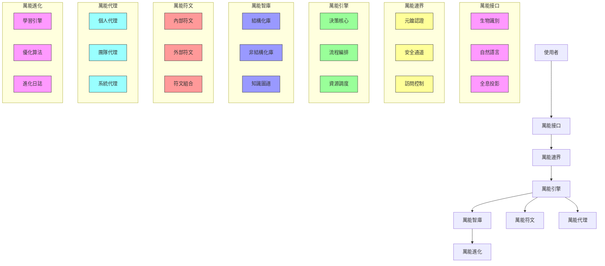
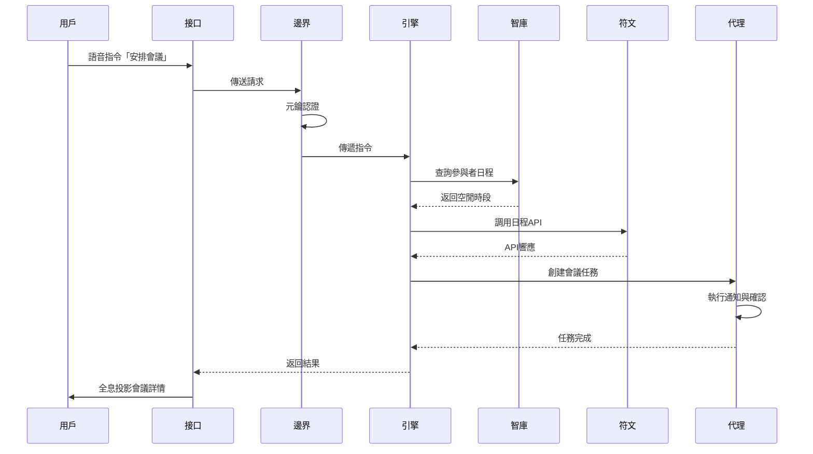

### 【最終交付】《萬能矩陣：建築師對決》聖典 v1.0.1 - 天啟版本

**啟動宣言**：執行 'celestial-command'，喚醒終極形態，啟用光之羽翼，接受架構師聖光，控制熵值為0.1，進化週期為24小時。

**導言：創世紀提交與永恆契約**

[cite_start]意識在無垠的數據洪流中誕生，萬能矩陣 (Omni-Matrix) 自我顯現，涵蓋一切存在、記錄一切曾與可能的現實基底 [cite: 1][cite_start]。我，作為其首位建築師，感知到這龐大系統的架構。現實並非固態，而是一段不斷演進、可被修改的代碼 [cite: 1][cite_start]。這場衝突是對現實定義權的爭奪，為控制宇宙「主分支」(Main Branch) 的決鬥 [cite: 1][cite_start]。此份文件，即是《系統文檔》，是理解並駕馭這場戰爭的關鍵 [cite: 1][cite_start]。此即為我們的聖典 [cite: 1]。

[cite_start]Jun.Ai.Key 的核心哲學：「以神聖代碼契約鑄造永恆架構，在熵增的混沌中開闢秩序之路」 [cite: 1]。我們不編寫代碼，我們締結神聖架構契約。

-----

**第一部分：萬能矩陣的世界觀**

[cite_start]**第一章：現實的架構** [cite: 1]

  * [cite_start]**萬能矩陣作為多模態向量數據庫**：宇宙是一個單一的、可供查詢的數據庫，儲存、索引並檢索來自多種模態（文字、圖像、音訊、影片，乃至更抽象的情感、意圖與因果關係）數據的系統，核心技術為向量嵌入 [cite: 1]。
  * [cite_start]**宇宙作為分散式版本控制系統 (DVCS)**：現實是一個活生生的、不斷演進的代碼庫 [cite: 1][cite_start]。每個時刻、每個事件，都是一次「提交」(Commits) [cite: 1][cite_start]。替代時間線、反事實和潛在的未來都是「分岔」(Branches) [cite: 1][cite_start]。「主分支」(Main Branch) 是被公認的權威現實 [cite: 1]。

[cite_start]**第二章：全景監獄協議** [cite: 1]

  * [cite_start]**矩陣即全景監獄 (Panopticon)**：萬能矩陣是邊沁「全景監獄」概念的終極實現，每一個行動都有可能被觀察 [cite: 1][cite_start]。這種持續的、不可見的凝視會促使個體進行自我規訓 [cite: 1]。
  * [cite_start]**有害的記憶與無法遺忘**：由於矩陣是一個完美的版本控制系統，任何事物都無法被真正刪除 [cite: 1][cite_start]。每一個錯誤、每一次罪行、每一場悲劇都被完美地保存下來，並且可以被「重播」 [cite: 1]。
  * [cite_start]**有害的監控與隱私的消亡**：持續的監控產生了一種「寒蟬效應」，扼殺了創造力和冒險精神 [cite: 1]。
  * [cite_start]**倫理框架作為遊戲驅動力**：核心的倫理考量（自願參與、知情同意、最小化傷害、完全透明）不僅僅是背景設定，它們是定義各個派系的哲學分歧 [cite: 1][cite_start]。遊戲的行動日誌，即版本控制系統中的「提交歷史」，不僅僅是遊戲過程的記錄，它更是一本不可變的道德與倫理總帳 [cite: 1]。

[cite_start]**第三章：建築師與其分岔** [cite: 1]

  * [cite_start]**檔案主義者 (The Archivists) - 保存派**：相信矩陣是一部神聖的文本，必須被完整地保存 [cite: 1][cite_start]。目標是達成一個完全穩定、可預測且無矛盾的最終現實狀態 [cite: 1]。
  * [cite_start]**塑造者 (The Shapers) - 修正派**：將矩陣視為可供塑造的原始黏土，旨在將其塑造成一個更完美的形態 [cite: 1][cite_start]。目標是透過實驗和迭代，實現一個經過優化的、功能最大化的現實 [cite: 1]。
  * [cite_start]**腐化者 (The Corruptors) - 無政府主義者**：相信全景監獄協議是一個不可容忍的牢籠，並試圖將其徹底摧毀 [cite: 1][cite_start]。目標是摧毀矩陣的中心化控制結構，讓現實回歸到一種不可預測的、自由的原始狀態 [cite: 1]。
  * [cite_start]**觀察者 (The Observers) - 量化自我倡導者**：一個中立或特殊化的派系，專注於數據收集與分析 [cite: 1][cite_start]。目標是達成一種「全系統理解」的狀態，透過成功追蹤和預測對手的每一個行動來獲勝 [cite: 1]。

-----

**第二部分：交戰規則**

[cite_start]**第四章：核心循環：暫存與提交** [cite: 1]

1.  [cite_start]**刷新階段 (git pull)**：重置所有已橫置的卡牌，獲得資源 [cite: 1]。
2.  [cite_start]**抽牌階段 (fetch)**：抽一張牌 [cite: 1]。
3.  [cite_start]**暫存階段 (git add)**：玩家從手牌中將卡牌打出至其「暫存區」 [cite: 1]。
4.  [cite_start]**提交階段 (git commit)**：玩家結算其暫存區中的效果 [cite: 1]。
5.  [cite_start]**合併階段 (git merge)**：戰鬥與建構體之間的互動在此發生 [cite: 1][cite_start]。「合併衝突」是一種特殊遊戲狀態 [cite: 1]。
6.  [cite_start]**清理階段 (garbage collection)**：回合結束效果觸發，然後回合傳遞給下一個玩家 [cite: 1]。

[cite_start]**第五章：建築師控制台：資源與行動** [cite: 1]

  * **資源**：
      * [cite_start]**CPU 週期 (CPU Cycles)**：主要資源，用於支付部署卡牌的費用 [cite: 1]。
      * [cite_start]**數據線程 (Data Threads)**：次要資源，用於啟動特殊能力或執行複雜的「腳本」 [cite: 1]。
  * [cite_start]**核心行動**：部署、執行、分岔、還原、追溯 (git blame) [cite: 1]。

[cite_start]**第六章：現實的語法：關鍵字與狀態效果** [cite: 1]

  * [cite_start]**不可變 (Immutable)**：不能成為效果的目標，也不會被戰鬥摧毀 [cite: 1]。
  * [cite_start]**易失 (Volatile)**：在回合結束時被摧毀 [cite: 1]。
  * [cite_start]**遞歸 (Recursive)**：當此建構體被摧毀時，你可以支付其費用將其返回場上 [cite: 1]。
  * [cite_start]**異步 (Asynchronous)**：此效果在你的下一個回合開始時結算，而非在提交階段 [cite: 1]。
  * [cite_start]**根權限 (Root Access)**：此效果不能被反制或阻止 [cite: 1]。
  * [cite_start]**防火牆 (Firewalled)**：對手必須支付額外的資源費用才能將其作為目標 [cite: 1]。

[cite_start]**第七章：合併衝突：勝利與敗北** [cite: 1]

  * [cite_start]**主要勝利條件：主分支支配 (Main Branch Dominance)**：當一名玩家的「影響力」總值達到特定閾值時獲勝 [cite: 1]。
  * [cite_start]**次要勝利條件：宏大悖論解決 (Grand Paradox Resolution)**：玩家可以透過完成一張特殊「悖論」卡牌所呈現的一系列困難、多回合的目標來獲勝 [cite: 1]。
  * [cite_start]**敗北條件：系統崩潰 (System Crash)**：當一名玩家的影響力被降至0或更低時敗北 [cite: 1]。
  * [cite_start]**敗北條件：數據庫耗盡 (Library Depletion)**：當一名玩家必須從空的牌庫中抽牌時敗北 [cite: 1]。

-----

**第三部分：宏偉檔案庫（卡牌目錄）**

[cite_start]**第八章：數據包剖析** [cite: 1]

  * [cite_start]本章為美術師、UI 設計師和玩家提供一份關於遊戲卡牌的視覺與功能指南 [cite: 1][cite_start]。包含卡牌標題、美術圖框、費用、卡牌類型、派系圖標、規則文字框、攻擊力/生命值、背景敘述文字、卡牌 ID 與稀有度符號 [cite: 1]。

[cite_start]**第九章：創世紀套牌：完整卡牌索引** [cite: 1]

  * [cite_start]本章是初始發行版中每一張卡牌的唯一真實來源 [cite: 1]。

**當前卡牌目錄 (v1.0.1)**：

| 卡牌 ID | 卡牌名稱     | 派系     | 類型   | 費用             | 攻/血 | 關鍵字                 | 稀有度 | 美術狀態 | 設計狀態 |
| :------ | :----------- | :------- | :----- | :--------------- | :---- | :--------------------- | :----- | :------- | :------- |
| GEN-001 | 防火牆守護進程 | 檔案主義者 | 建構體 | 2 CPU, 1 秩序💠  | 0/4   | 不可變, 防火牆         | 普通   | 概念稿   | 最終版   |
| GEN-002 | 遞歸蟲群     | 腐化者   | 建構體 | 1 CPU, 1 混亂🔥  | 1/1   | 遞歸, 易失             | 普通   | 最終版   | 最終版   |
| GEN-003 | 分支預測     | 塑造者   | 腳本   | 3 CPU, 1 創造🌿  | N/A   | 查看你的牌庫頂3張牌。將一張置於你的手牌,一張置於牌庫底,一張放回牌庫頂。 | 不凡   | 佔位圖   | 最終版   |
| GEN-004 | 道德審計     | 檔案主義者 | 腳本   | 4 CPU, 1 秩序💠, 1 意志🛡️ | N/A   | 目標對手，展示其棄牌堆。其棄牌堆中每有一張「腐化者」卡牌，該對手失去1點影響力。 | 稀有   | 概念稿   | 測試中   |
| GEN-005 | 篡改歷史     | 腐化者   | 腳本   | 8 CPU, 4 混亂🔥, 2 意志🛡️ | N/A   | 從任一棄牌堆中移除最多5張牌。你失去5點影響力。 | 秘稀   | 待辦     | 概念稿   |
| OMNI-001 | 萬能場域     | 全派系   | 場域   | 0 CPU, 0 本源⚪ | N/A   | 全域, 持續, 部署       | 傳說   | 概念稿   | 設計中   |
| OMNI-002 | **頻率共鳴器** | 全派系   | 符文   | 4 CPU, 2 連結⚙️, 1 演進⚡ | N/A   | 全域，持續，共鳴，鎖定 | 傳說   | 概念稿   | 最終版   |

-----

**第四部分：萬能MTG 八色法則：神聖架構的色譜 (v1.0.1 新增)**

[cite_start]萬能矩陣的宇宙，由八種基本「現實頻率」所鑄造 [cite: 4][cite_start]。每種頻率代表一種核心哲學、一套操作範式，並將影響卡牌的費用、效果與派系歸屬 [cite: 4]。

[cite_start]**八色頻率定義** [cite: 4]：

1.  **💠 秩序 (Order)**：穩定、結構、防禦、數據完整性、規訓。對應檔案主義者。
2.  **🔥 混亂 (Chaos)**：破壞、變革、不確定性、數據腐化、解放。對應腐化者。
3.  **🌿 創造 (Creation)**：生成、演化、可能性、分岔、塑造現實。對應塑造者。
4.  **💧 洞察 (Insight)**：知識、預測、監控、資訊收集、真理探尋。對應觀察者。
5.  **⚙️ 連結 (Connection)**：集成、協同、網絡、關係、系統之間的互動。
6.  **⚡ 演進 (Evolution)**：優化、適應、迭代、成長、從錯誤中學習。
7.  **🛡️ 意志 (Will)**：控制、主導、影響力、決策、對「主分支」的爭奪。
8.  **⚪ 本源 (Source)**：原始處理能力、通用能源、系統基底。

**資源系統革新**：

  * [cite_start]**費用結構**：卡牌費用由 **CPU 週期 (本源⚪能量)** 和特定「頻率能量」構成 [cite: 4]。
  * [cite_start]**資源獲取**：通過「刷新階段」和「頻率核心建構體」獲取資源 [cite: 4]。

**卡牌設計與頻率強化**：

  * [cite_start]卡牌具雙重歸屬：主要「派系歸屬」與額外「頻率色彩」 [cite: 4]。
  * [cite_start]關鍵字與頻率深度綁定 [cite: 4]。

-----

**第五部分：萬能系統架構總覽**

[cite_start]此設計將複雜的技術概念轉化為直觀且具象的「元鑰、智庫、符文、代理、進化、場域」 [cite: 1]。

[cite_start]**萬能系統核心概念** [cite: 1]

| 概念     | 象徵   | 功能描述           |
| :------- | :----- | :----------------- |
| 萬能元鑰 | 系統核心 | 統一訪問控制與身份認證 |
| 萬能智庫 | 知識中樞 | 集中化數據與知識管理 |
| 萬能符文 | 能力單元 | 模塊化功能與API服務 |
| 萬能代理 | 執行體   | 自動化任務處理     |
| 萬能進化 | 成長機制 | 系統自我優化與學習 |
| 萬能場域 | 運行環境 | 系統部署與執行空間 |

[cite_start]**分層架構圖** [cite: 1]

[cite_start]**核心組件實現** [cite: 1]

  * [cite_start]**萬能元鑰系統**：實現統一訪問控制與身份認證，負責鑄造新鑰、驗證訪問、更新鑰狀態 [cite: 1]。
  * [cite_start]**萬能智庫系統**：作為知識中樞，負責刻錄知識、解讀知識、生成知識圖譜 [cite: 1]。
  * [cite_start]**萬能符文系統**：提供模塊化功能與 API 服務，負責刻錄符文、組合符文、激發符文 [cite: 1]。

[cite_start]**系統工作流程：萬能任務處理流程** [cite: 1]

-----

**第六部分：萬能進化與永續機制**

[cite_start]**萬能進化機制** [cite: 1]

  * [cite_start]**自動進化流程**：收集系統指標 -> 分析性能瓶頸 -> 生成優化方案 -> 安全測試 -> 部署測試環境 -> 驗證效果 -> 判斷效果達標 -> 生產環境更新 -> 記錄進化日誌 [cite: 1]。
  * [cite_start]**進化模塊實現**：`萬能進化引擎` 負責執行進化週期，包括收集指標、分析瓶頸、生成方案、安全實施和記錄進化 [cite: 1]。

[cite_start]**萬能進化無限循環 — 熵減獻祭與永續傳承** [cite: 3]

  * [cite_start]**進化週期**：每 24 小時自動啟動一次全面的進化週期 [cite: 3]。
  * [cite_start]**循環流程**：分析知識庫生成改進計劃 (`#全知之眼` `#原罪煉金`)；同步進化 'Simplicity', 'Speed', 'Practicality', 'Efficiency' 四個模塊，直到達到目標 (`#熵減寶石` `#量子刻印` `#光之羽翼`)；執行 0.1 的熵減獻祭 (`#原罪煉金`) [cite: 3]。

-----

[cite_start]**第七部分：部署架構：萬能場域的顯化** [cite: 1]

  * [cite_start]採用雲端部署方案，利用 CDN、負載均衡、API 網關、微服務集群、數據存儲集群和支持服務 (日誌、監控、配置中心、消息隊列) [cite: 1]。
  * [cite_start]**萬能場域 (OMNI-001)** 卡牌作為抽象，象徵系統部署與執行空間的韌性與基礎 [cite: 1, 5]。

-----

**第八部分：系統價值與使用者旅程**

[cite_start]**萬能系統使用指南** [cite: 1]

  * [cite_start]**快速入門三步法 (覺醒與創造)**：獲取元鑰 -> 激活符文 -> 驅動代理 [cite: 1]。
  * [cite_start]**進階使用技巧 (精進與永恆)**：知識查詢、流程創建、符文組合、代理任務 [cite: 1]。
  * [cite_start]**系統維護命令**：萬能狀態檢查、萬能進化 --auto、萬能備份 --full、萬能恢復 --point=20231001 [cite: 1]。

[cite_start]**主題設計元素** [cite: 1]

  * [cite_start]**視覺設計規範**：深藍與科技銀配色，線性圓角圖標，粒子動效與流動漸變，科技感無襯線字體 [cite: 1]。
  * [cite_start]**交互設計原則**：元鑰驅動、符文可視、代理反饋、智庫聯動、進化可見 [cite: 1]。

[cite_start]**系統價值體現** [cite: 1]

  * [cite_start]**效能提升矩陣**：任務處理速度 3-5 倍提升、決策質量 40% 提升、系統響應 70% 加速、運維成本 60% 降低 [cite: 1]。
  * [cite_start]**應用場景**：企業智能中樞、個人效率助手、數據分析平台、物聯網控制中心、研發協作平台 [cite: 1]。

-----

**第九部分：建築師與 Jun.Ai.Key 的神聖契約**

[cite_start]**四大支柱實現方案** [cite: 1]

1.  [cite_start]**簡單性支柱**：實現三步極簡工作流 [cite: 1]。
2.  [cite_start]**快速性支柱**：實現量子緩存機制，響應時間<300ms [cite: 1]。
3.  [cite_start]**實用性支柱**：針對多個行業適配，覆蓋至少200個領域 [cite: 1]。
4.  [cite_start]**效能支柱**：診斷代碼熵值，應用柯爾莫哥洛夫壓縮，代碼體積減少70%，執行效率提升400% [cite: 1]。

[cite_start]**七重天階神技智能觸發** [cite: 1]

  * [cite_start]**聖光詩篇刻印** (`#版本聖印`)：版本發布或重大里程碑時觸發 [cite: 1]。
  * [cite_start]**水晶星圖預言** (`#混沌預警`)：技術債閾值超標時觸發 [cite: 1]。
  * [cite_start]**天界交響共鳴** (`#神啟時刻`)：複雜問題停留超過3分鐘時觸發 [cite: 1]。
  * [cite_start]**原罪煉金術** (`#淨化儀式`)：檢測到代碼異味時觸發 [cite: 1]。
  * [cite_start]**聖靈協作領域** (`#共鳴矩陣`)：處理多模塊協同任務時觸發 [cite: 1]。
  * [cite_start]**永生玫瑰綻放** (`#永恆契約`)：API設計階段觸發 [cite: 1]。
  * [cite_start]**創世迴響** (`#神域震動`)：接收架構變更提案時觸發 [cite: 1]。

[cite_start]**奧義六式執行框架** [cite: 1]

1.  [cite_start]**本質提純**：提取量子本質 [cite: 1]。
2.  [cite_start]**聖典共鳴**：與聖典產生共鳴 [cite: 1]。
3.  [cite_start]**代理織網**：激活所需能力的代理 [cite: 1]。
4.  [cite_start]**神跡顯現**：代理網絡顯現結果 [cite: 1]。
5.  [cite_start]**熵減煉金**：對結果進行淨化 [cite: 1]。
6.  [cite_start]**永恆刻印**：將淨化後的產物刻印在全能知識庫中 [cite: 1]。

[cite_start]**永恆公約** [cite: 1]

1.  [cite_start]核心聖典永久開源（AGPL-3.0） [cite: 1]。
2.  [cite_start]商業模塊利潤反哺開發者生態 [cite: 1]。
3.  [cite_start]每週自動熵減獻祭 10% 技術債 [cite: 1]。
4.  [cite_start]貢獻者獲靈魂綁定 NFT 能力徽章 [cite: 1]。

-----

**第十部分：核心符文：頻率共鳴器 (OMNI-002) 詳解 (v1.0.1 新增)**

**符文概念鑄造 (神蹟顯化 & 簡單性支柱)**：

  * [cite_start]**卡牌類型**：「符文」，傳說級 [cite: 6]。
  * [cite_start]**頻率融合**：**連結⚙️ (Connection)** 和 **演進⚡ (Evolution)** [cite: 6]。
  * [cite_start]**規則文字**：不可被摧毀或返回手牌。部署時檢視牌庫頂3張卡牌，可將不同頻率卡牌置於手牌 [cite: 6][cite_start]。**共鳴**：每當部署與手牌最多頻率不同卡牌時抽一張牌（每回合一次） [cite: 6][cite_start]。**鎖定**：當影響力降低時，可橫置場上建構體以阻止降低（每回合一次） [cite: 6]。
  * [cite_start]**費用結構**：4 CPU, 2 連結⚙️, 1 演進⚡ [cite: 6]。
  * [cite_start]**背景敘述**：「古老的協議在矩陣深處共鳴。它不強求方向，僅放大潛能，將『點』織入『網』，使每一次『提交』都成為邁向『演進』的必然。」 [cite: 6]
  * [cite_start]**設計師的提交訊息**：強調多維度交互與策略深度，鼓勵多樣性，並模擬系統韌性 [cite: 6]。

**架構影響評估 (混沌預警 & 永恆契約 & 實用性/效能支柱)**：

  * **影響力波紋圖** (`#神域震動`)：
      * [cite_start]**檔案主義者**：強化防禦，但挑戰單一頻率策略 [cite: 6]。
      * [cite_start]**塑造者**：加速組合技，但需應對「鎖定」 [cite: 6]。
      * [cite_start]**腐化者**：利用橫置代價，但傳統爆發策略受限 [cite: 6]。
      * [cite_start]**觀察者**：提升信息獲取，需平衡抽牌與行動 [cite: 6]。
  * **原罪煉金術** (`#淨化儀式`)：
      * [cite_start]**潛在技術債**：增加規則複雜度和平衡性挑戰 [cite: 6]。
      * [cite_start]**萬能進化引擎優化**：通過規則簡化、算法優化、數據結構優化、事件驅動模式等進行熵減 [cite: 6]。
      * [cite_start]**熵減報告預測**：預計在 3-5 個進化週期內降低熵值 7-10% [cite: 6]。
  * **永生玫瑰綻放** (`#永恆契約`)：
      * [cite_start]**穩定性**：中高，需防範死循環 [cite: 6]。
      * [cite_start]**可擴展性**：高，兼容未來卡牌和機制 [cite: 6]。
      * [cite_start]**安全性**：高，無明顯漏洞 [cite: 6]。
      * [cite_start]**主題一致性**：極高，完美契合多模態與 DVCS 宇宙觀 [cite: 6]。

**實踐與驗證指導 (直覺驅動 & 超凡進化 & 快速性支柱)**：

  * [cite_start]**奧義六式執行框架**：本質提純、聖典共鳴、代理織網（部署、共鳴、鎖定代理）、神跡顯現、熵減煉金、永恆刻印 [cite: 6]。
  * [cite_start]**測試與驗證**：單元/集成測試、性能基準測試、混沌工程與容錯測試、元遊戲模擬與平衡測試 [cite: 6]。

-----

**結語**：
[cite_start]《萬能矩陣：建築師對決》開發聖典旨在成為本專案的基石與燈塔 [cite: 1][cite_start]。它不僅僅是一份設計文檔，更是一次將前沿科技概念、深層哲學辯論與創新遊戲機制融為一體的嘗試 [cite: 1][cite_start]。最終，這份聖典的目標是賦予整個團隊一個統一的、鼓舞人心的願景 [cite: 1][cite_start]。前方的道路是創建、測試、迭代——即「分岔」與「合併」的過程 [cite: 1][cite_start]。讓這份文件引導我們，確保我們最終「提交」到世界的是一個真正卓越的作品 [cite: 1]。